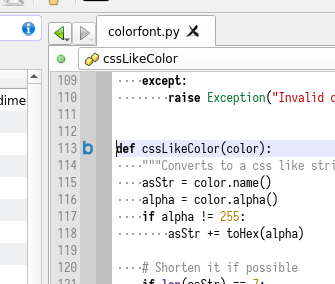
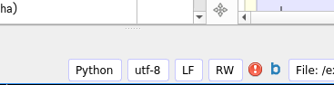

Analysis: Complexity
====================

Codimension integrates the Radon python package
([Radon homepage](https://radon.readthedocs.io/en/latest/))
to calculate cyclomatic complexity of the python code.

The complexity analysys is working automatically so there is no need to invoke
it explicitly. Codimension detects pauses in typing and re-calculates the
cyclomatic complexity scores if necessary. Depending on the score the rank is
calculated from A to F as follows:

| Rank | Cyclomatic complexity score | Risk |
|:----:|:---------------------------:|:-----|
| A    | 1 - 5                       | low - simple block
| B    | 6 - 10                      | low - well structured and stable block
| C    | 11 - 20                     | moderate - slightly complex block
| D    | 21 - 30                     | more than moderate - more complex block
| E    | 31 - 40                     | high - complex block, alarming
| F    | 41+                         | very high - error-prone, unstable block

The ranking is provided for functions, classes and class methods.

Codimension presents the ranking results in two ways:
- Individually for each function, class and class method.
- Summary for the current editing buffer.

Individual results appear on the editor margin at the line where a defenition
of the corresponding item starts. A letter of the rank is drawn if the rank
is not A:

The summary is displayed on the status bar. The worst rank for the current
editing buffer is calculated and the corresponding letter is displayed.

The status bar cyclomatic complexity rank icon supports a context menu.
Click the right mouse button on it and a list of the items in the current editing
buffer will appear together with their ranking. The items are sorted in the
menu starting from the worst rank. The items with rank A are not shown.

