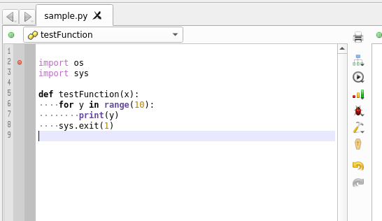
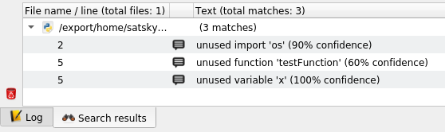
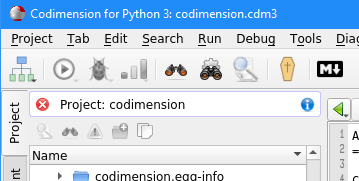

Analysis: Dead Code
===================

Codimension integrates the Vulture python package
([github repository](https://github.com/jendrikseipp/vulture))
to find unused code in individual python files as well as in the whole project.

To invoke the analysis for an individual python file it should be opened in
the editor. Then two ways could be used:

- Select `Tools -> Find tab dead code` option in the main menu
- Click on the tab vertical toolbar button which shows a small coffin

The analysis may take time depending on the file size so there is a
progress modal dialog which will disappear as soon as the analysis is
finished.

The results will appear on the `Search results` tab at the bottom.

The analysis is suggestive so the results should be carefully examined
before anything is deleted.

If a project is loaded then the dead code analysis can be invoked for all
the python files in the project at once. Two ways could be used to do so:

- Select `Tools -> Find project dead code` option in the main menu
- Click on the IDE horizontal toolbar button which shows a small coffin

Similarly, a modal progress dialog will appear and the results will be
available on the `Search results` tab at the bottom.

