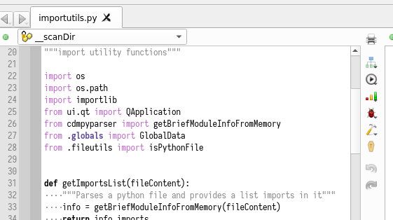
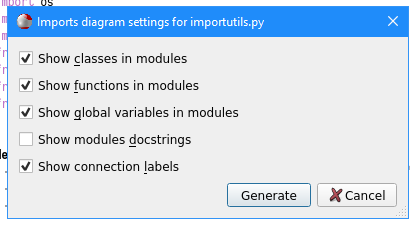
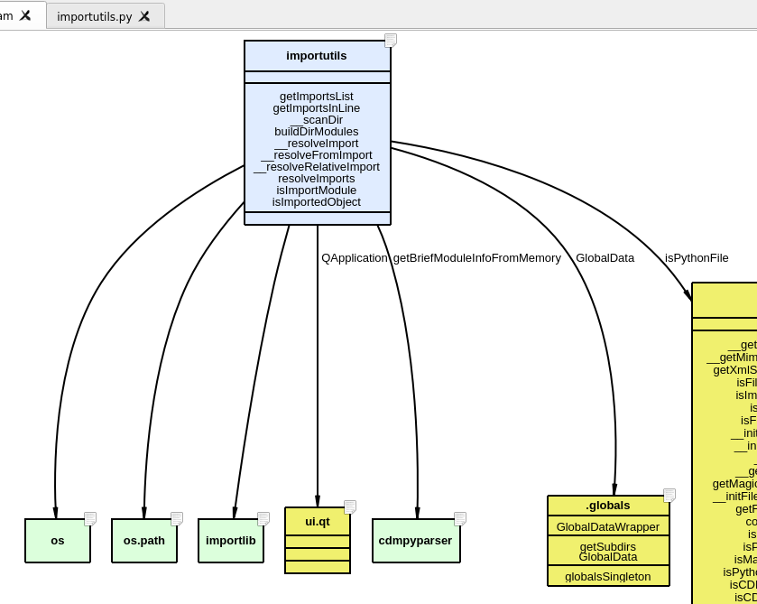

Analysis: Dependencies
======================

Codimension supports generation of the imports diagrams for a python
file, for a directory with python files and for a whole project. In python the
import statements introduce dependencies so this is what is taken into
consideration when these diagrams are built.

Strictly speaking, there could also be data dependencies. E.g. the source code
may open data files or sockets and read from them. These dependencies are not
shown on the generated diagram (at least at the time of writing).

To invoke the functionality of building an imports diagram a few options are
supported. The options for an individual file are:
- Click on the vertical toolbar button when a python file is loaded
- Click on the vertical toolbar button when a python file is
  loaded and keep it pressed for a moment. A context menu will appear with the
  option of a fine tuned imports diagram. Select this option.
- Select the main menu `Diagrams -> Tab imports diagram` option when a python
  file is loaded
- Select the main menu `Diagrams -> Tab imports diagram...` option when a
  python file is loaded. The option is for a fine tuned imports diagram.

This is how the toolbar button looks: see the upper right corner. The button has
an icon of connected blocks.

If a fine tuned diagram option is selected then the following dialog will appear:

There are a few options of what to include to the generated diagram.

To invoke the functionality of building an imports diagram for a group of files
please use:
- All files in a directory: open a context menu for a directory in the project
  viewer. Select `Imports diagram` or `Fine tuned imports diagram` option.
- All project files: click on the main toolbar button (connected blocks icon)
- All project files: click on the main toolbar button (connected blocks icon)
  and keep it pressed for a moment. A context menu will appear with the
  option of a fine tuned imports diagram. Select this option.
- All project files: select the main menu `Diagrams -> Project imports diagram`
  option.
- All project files: select the main menu `Diagrams -> Project imports diagram...`
  option.

The generated imports diagram looks similar to the following:

The diagram has color coding. Different colors are used for
- the modules (files) which were analyzed for dependencies
- the standard modules
- the modules pathes to which could not be resolved
- the other project modules
- theother non-project modules

Some interactivity on the diagram is also supported. The modules' docstrings
are shown as tooltips for the upper right corner icons. Double click on a
module opens the corresponding file if possible. Similarly double click on
what is imported also opens a file.

