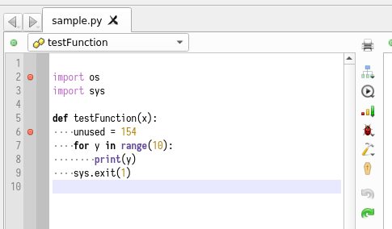
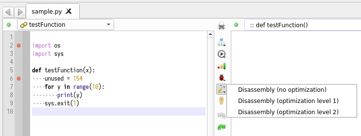
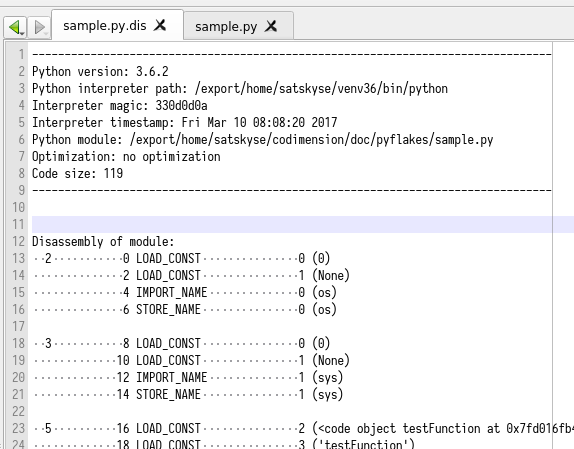

Analysis: Disassembling
=======================

Codimension supports disassembling of the python code. The disassembling can be
different depending on the optimization level:

- no optimization
- optimization level 1
- optimization level 2

There are a few ways to invoke the analysis:

- Select `Tools -> Disassembly` option in the main menu and then select the
  desired optimization level for disassembly
- Click on the tab vertical toolbar button which shows a small hummer
- Use a context menu for a python file in the project or the file system
  browser and select the `Disassembly` option followed by the desired
  optimization level.

The tab vertical toolbar button invokes disassembly without optimization by
default.

The button supports a pulldown menu so if you click on it and hold the mouse
button pressed for a second then a menu with more options will appear.

Regardless how the analysis is invoked the results will be presented in the
same way. Codimension will open another tab with the disassembly results:

