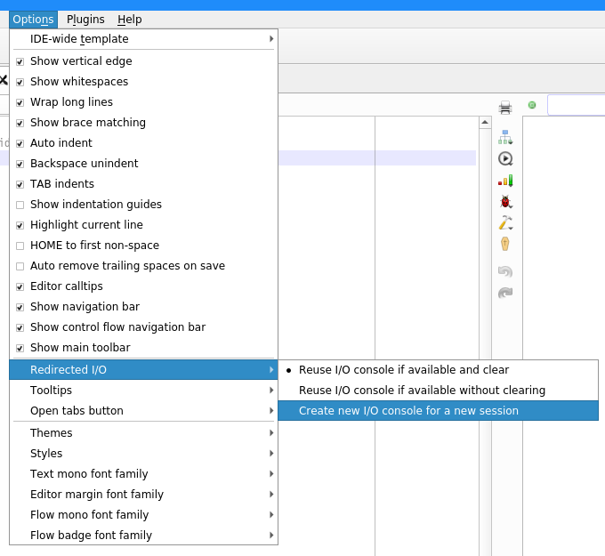

IDE Customization
=================

Codimension supports a number of customizable parameters via editing
the skin files. See the documentation [here](../colorschemes/colorschemes.md).

On top of it Codimension has a UI for changing some of the most frequently
used settings, including the editor settings. The UI is available in the
IDE main menu -> Options

All the slectable options are radio or check box choices. Selecting any of them
(except of a skin) affects the IDE immediately.

| Option | Description |
|:-------|:------------|
| Show vertical edge | To show the vertical edge in the text editor at certain character. Default: 80. Can be changed via editing `~/.codimension3/settings.json` |
| Show whitespaces | To show the whitespace characters in the text editor unless it is exactly one character between words |
| Wrap long lines | If a line does not fit the available width then it will be wrapped to the next one (display only) |
| Show brace matching | Highlight braces when the text cursor is on one of them |
| Show indentation guides | To show the indentation guides (only if whitespace characters are suppressed) |
| Highlight current line | To highlight the line where the cursor is |
| HOME to first non space | To move the text cursor to the first non space character when the HOME key is pressed |
| Auto remove trailing spaces on save | Automatically remove the trailing spaces when the file is saved |
| Editor calltips | To show the editor calltips |
| Show navigation bar | To show the text editor navigation bar |
| Show control flow navigation bar | To show the control flow navigation bar |
| Show main toolbar | To show the main toolbar |
| Redirected I/O | The submenu to select the behavior of the redirected I/O concole tab at the bottom |
| Tooltips | The submenu to select what tooltips the IDE will display |
| Open tabs button | The submenu to specify the IDE behavior when the 'Open tabs' button is clicked and an item is selected |
| Skins | The submenu to select the IDE skin (requires IDE restart) |
| Styles | The submenu to select the QT library widgets appearence |
| Text mono font family | The submenu to select the monospace font face |
| Editor margin font family | The submenu to select the editor margin font face |
| Flow mono font family | The submenu to select the graphics pane font face |
| Flow badge font family | The submenu to select the graphics pane scope item badge font face |

The submenues to select fonts are populated dynamically depending on what fonts
are available on a particular system. On a Linux system users may add fonts so
that they are available for them in Codimension by copying the font files into
their `~/.fonts` directory. Here are a few links to fonts which may be of
interest:
- [Iosevka](https://github.com/be5invis/Iosevka) monospace font
- [Ubuntu](http://font.ubuntu.com/) mono font
- [Cascadia](https://github.com/microsoft/cascadia-code) monospace font

