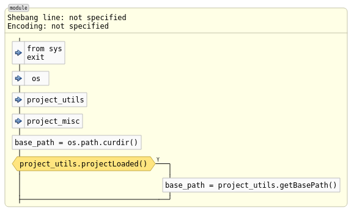
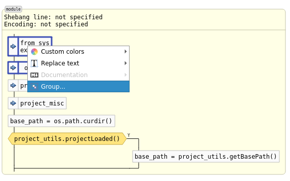
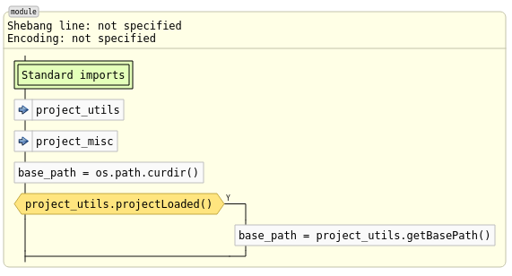
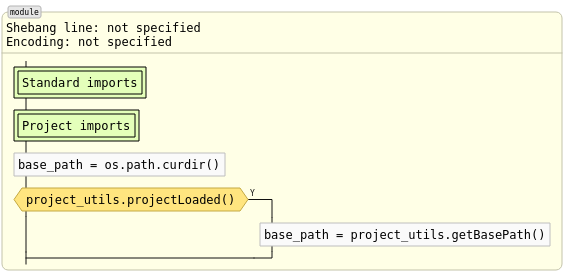
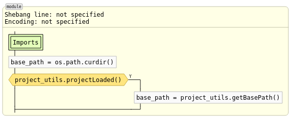
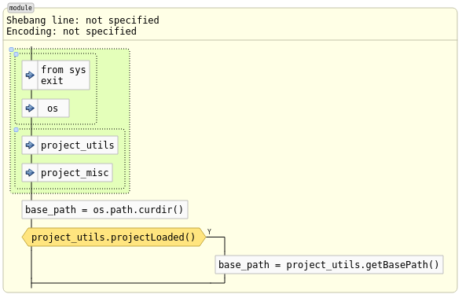

Graphics Pane: Grouping
=======================

The Codimension graphics pane supports grouping of items. The groups could be
nested.

Suppose there is a diagram like that:

Now wsuppose we want to group the standard imports so that there one box drawn
instead of two. To do so we select the corresponding import boxes on the graphics
pane using:
- a rubber band selection: holding the left mouse button pressed move the mouse
  so that the necessry items are within the highlighted area
- an individually added items into the selection: having the keyboard Ctrl key
  pressed click the mouse left button on the necessary items

When the selection is ready invoke the context menu (right mouse button on one
of the selected items).

Selecting the `Group...` item will bring up a dialog where you can type the
new group title. After providing the group title the diagram will look like:

Let's do the same with the project specific imports:

Groups can be also grouped similarly to all other items. Let's select the 
two groups we just created and group them into one item with the title `Imports`:

Obviously, at any moment a group title can be edited or the items can be ungrouped.
This functionality is available via a group context menu.

The group can also be expanded to display its content. That could also be done
via a context menu. Here is how the diagram looks when all the groups are expanded:

An expanded group has a sensitive spot at the top left corner (blue circle).
When a mouse cursor hovers it a popup is displayed with the group title.
