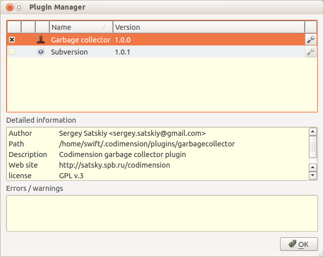
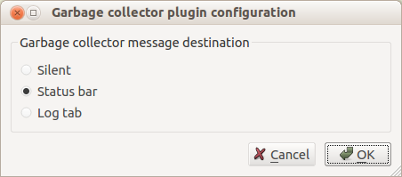

Codimension Plugins Tutorial
============================

In this tutorial two major topics are discussed. The first part discusses how
plugin support is implemented in Codimension. The second part discusses
implementation of a simple plugin and what is available for plugins.

Plugin Support Implementation
-----------------------------

The shortest answer on the question "what is a Codimension plugin?" is as
follows: a Codimension plugin is a Python class implemented in a certain way.
Codimension is written in Python and thus its plugins should also be written in
Python.

Before the implementation details are discussed it makes sense to introduce a
few terms Codimension uses while it works with plugins.

At the start time Codimension looks for plugins in two places. The first one is
`/usr/share/codimension-plugins/`. The second one is the directory called
`.codimension/plugins` located in the user home directory. So on Linux system
the latter most probably will be `~/.codimension/plugins`. It is highly
recommended that each plugin occupies a designated directory where it keeps all
the required files. So on a certain system the related directories structure
may look as follows:

~~~
/usr/share/codimension-plugins/plugin1/...
                               plugin2/...
                               plugin3/...

/home/mike/.codimension/plugins/plugin4/...
                                plugin5/...
                                plugin6/...
~~~

Depending on a plugin location Codimension splits all the found plugins into two
groups: system wide plugins and user plugins. So in the example above `plugin1`,
`plugin2` and `plugin3` are **system wide** plugins while `plugin4`, `plugin5` and
`plugin6` are **user** plugins.

The next pieces which are important for Codimension are a plugin name and a
plugin version. A name and a version are stored in a plugin description file 
(it will be discussed later). That description file is what triggers loading a
plugin.

The next important piece is that each plugin can be enabled or disabled (a pair
of other terms activated/deactivated is also used further with the same
meaning). While loading plugins Codimension initially treats all plugins enabled
so a newly installed plugin will be automatically enabled next time Codimension
starts. It is possible however that a plugin conflicts with another plugin.
Certain types of conflicts can be detected by Codimension automatically and 
Codimension can disable some plugins to resolve a conflict. The following rules
are used for automatic conflict resolution:

- If there is a user and a system wide plugin with the same name then the user
  plugin wins.
- If there are two plugins with the same name and both of them are either user
  or system wide then their versions are taken into consideration. The higher
  version wins.
- If names, vaersions and locations of two plugins match then an arbitrary one
  wins.

There are a few other cases when Codimension disables a plugin automatically. A
good example of such a case is when a plugin does not implement the required
interface.

An important detail on the plugin initialization stage is that regardless whether
a plugin is enabled or disabled it is instantiated. The plugin class instance will
stay in memory till Codimension is closed.

The user is always able to enable or disable plugins manually and in particular
resolve detected conflicts the required way if automatic resolution is not what
is needed. The manual control of plugin states is done in the plugin manager.
The manager user interface is available via main menu **Options->Plugin 
Manager** menu item as shown below.

Each plugin can move between the enabled and disabled state an arbitrary number
of times within a single Codimension session. This could be illustrated as
follows.

The last term Codimension introduces for plugins is a plugin category. Plugins
could require different support on the IDE side and a plugin category is the way
how to distinguish the required support. For example, a spell checker plugin
might need certain support targeted to text editing while a plugin which
implements a regular expression visual testing facility does not need text
editing support at all. A plugin category defines an interface variation between
Codimension and a plugin. The categories come in a form of predefined base
classes and each plugin must derive from one of them.

Plugin Files
------------

As it was mentioned above it is highly recommended that a plugin occupies a
designated directory. For example, directory content for a plugin may look as
follows.

~~~
/home/mike/.codimension/plugins/pdfexporter/pdfexporter.cdmp
                                            __init__.py
                                            util_functions.py
                                            config_dialog.py
~~~

The `pdfexporter.cdmp` file contains a textual plugin description. The name of the
file does not matter, Codimension looks for the .cdmp file extensions. A
content of the pdfexporter.cdmp file may be similar to the following.

~~~ini
[Core]
Name = PDF exporter
Module = .

[Documentation]
Author = Mike Slartibartfast <mike.slartibartfast@some.com>
Version = 1.0.0
Website = http://mike.slartibartfast.homelinux.com/pdfexporter
Description = Codimension PDF exporter plugin
License = GPL v.3
~~~

The `[Core].Name` value is an arbitrary string however it is better to keep it
relatively short. The `[Core].Module` value is a directory path where
Codimension plugin resides. It is recommended that all the plugin files are
sitting in a designated directory including the plugin description file and 
therefore the `[Core].Module` value refers to the very directory it is sitting
in. The '.' value is the recommended value for all the Codimension plugins.

The `[Documentation]` section has self explanatory values. A plugin can add any
values to this section and all of them will be displayed in the **Detailed 
information** box in the plugin manager dialog when a plugin is selected.

The `__init__.py` file is the one where a plugin class definition must reside.
In the example above the plugin also has some utility functions in the
`util_functions.py` and a configuration dialog in separate files. To import
`util_functions` and `config_dialog` modules in `__init__.py` there is no need
to use relative imports. The `__init__.py` can simply use:

~~~python
# The plugin modules do not require relative import
import config_dialog
from util_functions import designCoastline
~~~

The Codimension modules are also available for the plugin code. So a plugin can
use statements similar to the following:

~~~python
# Importing pixmaps cache from a Codimension module
from utils.pixmapcache import PixmapCache
codimensionLogo = PixmapCache().getPixmap('logo.png')
~~~

It was mentioned in the previous section that a plugin class must derive from
one of the predefined plugin category base class. So a part of the PDF exporter
plugin class hierarchy may look as follows:

The `PDFExporterPlugin` class must reside in the `__init__.py` file. This is the
class which implements the plugin interface. The plugin developer does not need
and should not make any changes in any other classes shown on the diagram.

The `WizardInterface` class is a Codimension provided plugin category base
class. The class is defined in `codimension/src/`
`plugins/categories/wizardiface.py`. The class has a set of member functions
some of which have to be implemented by the plugin of this category. The member
function documentation strings describe in details what is expected by
Codimension. At the time of writing (Codimension v.4.3.1) the `WizardInterface`
and the `VersionControlSystemInterface` are the only supported plugin categories.
When a new plugin category is introduced its base class will appear in the
`codimension/src/plugins/categories/` directory.

The `CDMPluginBase` class is a Codimension provided convenience class which
simplifies access to the major IDE objects. The class definition resides in the
`codimension/src/plugins/categories/cdmpluginbase.py` file. Having
`CDMPluginBase` class in the hierarchy makes it possible for a plugin class to
use easy to read statements similar to the following:

~~~python
if self.ide.project.isLoaded():
    # The ide has a project loaded
    ...
else:
    # There is no project, the user edits individual files
    ...
~~~

Access to all the IDE objects should start with:

~~~python
self.ide. ...
~~~

See the `IDEAccess` class in the 
`codimension/src/plugins/categories/cdmpluginbase.py` file for a full list of
provided IDE objects.

Codimension uses thirdparty library called
[yapsy](http://yapsy.sourceforge.net/) to build plugin support on top of it.
Yapsy needs to have IPlugin in the plugin class hierarchy and so it is here.
A plugin developer should not need to deal with this class directly however.

The `QObject` class is a PyQt provided class. The class is included into the
hierarchy for convenience. Codimension uses QT library for the user interface
and therefore QT signals are used quite often. Having `QObject` in the base
gives a convenient way to subscribe for signals and to emit them, e.g. a plugin
may have the following code:

~~~python
self.ide.project.projectChanged.connect(self.__onProjectChanged)
~~~

Plugin Example: Garbage Collector Plugin
----------------------------------------

The idea of an example plugin is quite simple. The Python garbage collector
triggers objects collection at pretty much unknown moments and the plugin will
make it more predictable. The garbage collector plugin (GC plugin) will call
the `collect()` method of the `gc` Python module when:
- a tab is closed
- a project is changed
- new files appeared in a project
- some files are deleted from a project

The `gc.collect()` call provides an information of how many objects were
collected and this could be interesting to see. So a
message should be shown somewhere. To make it more user friendly the GC plugin
should provide a configuration dialog with options where to show the message:
- in the log tab
- on the status bar
- do not show anything

The selected option should be memorized and restored the next time Codimension
starts.

Having the requirements at hand let's start implementing the GC plugin with
creating a directory where all the plugin files will be located.

~~~shell
> mkdir garbagecollector
> cd garbagecollector
~~~

First, we need the plugin description file, let's call it
`garbagecollector.cdmp`. The content of the file will be as follows:

~~~ini
[Core]
Name = Garbage collector
Module = .

[Documentation]
Author = Sergey Satskiy <sergey.satskiy@gmail.com>
Version = 1.0.0
Website = http://codimension.org
Description = Codimension garbage collector plugin
License = GPL v.3
~~~

The GC plugin will belong to the wizard plugin category so it must derive from
the `WizardInterface` class. The definition of the class must be in the
`__init__.py` file:

~~~python
from plugins.categories.wizardiface import WizardInterface

class GCPlugin(WizardInterface):
    def __init__(self):
        WizardInterface.__init__(self)
        return
~~~

Codimension instantiates all the found plugins regardless whether they are activated
or not. So the GC plugin `__init__` does not do any significant resource consuming
initializations.

One of the first things Codimension does before a plugin is acivated, it asks
the plugin if the current IDE version is supported by the plugin. Codimension
passes the current version as a string, e.g. `"4.3.1"`. The method must be implemented
by the plugin and for the GC plugin it is trivial, all the versions are supported:

~~~python
    @staticmethod
    def isIDEVersionCompatible(ideVersion):
        return True
~~~

The next pair of methods which must be implemented in a plugin is `activate` and
`deactivate`. Obviously, the `activate` method will be called when a plugin is activated. It
may happened at the start time automatically or when a user activates previously
deactivated plugin. Therefore it is generally a good idea to have plugin data
allocated and deallocated in these two methods respectively.

The first thing to be done in the `activate` method is to call `activate` of the
interface base class. If this call is forgotten then `self.ide.` statements will
not work at all and the plugin management system may also be confused. Respectively,
the `deactivate` method should call `deactivate` of the interface base class as the
last thing to do.

The GC plugin initialization is basically connecting a few IDE signals with the
plugin member functions. When the plugin is deactivated the signals should be disconnected.

~~~python
    def activate(self, ideSettings, ideGlobalData):
        WizardInterface.activate(self, ideSettings, ideGlobalData)

        self.ide.editorsManager.tabClosed.connect(self.__collectGarbage)
        self.ide.project.projectChanged.connect(self.__collectGarbage)

    def deactivate(self):
        self.ide.project.projectChanged.disconnect(self.__collectGarbage)
        self.ide.editorsManager.tabClosed.disconnect(self.__collectGarbage)

        WizardInterface.deactivate(self)
~~~

The GC plugin needs some configuring. The user should be able to instruct the
plugin where the garbage collection information should be displayed. It is going
to be a modal graphics dialog with three radio buttons:

Let's place the dialog code into a separate file `configdlg.py`. Three integer
constants will be defined in the file as well. These constants identify the
GC plugin information message destination.

Codimension provides a unified way to call plugin configuration dialogs. Look
at the plugin manager screenshot above. There is a button with a wrench on it
for each found plugin. If a plugin needs configuring then its button will be
enabled.

In order to tell Codimension if a plugin needs configuring there is an interface
method which should return a python callable or **None** if no configuring is
required.
The GC plugin needs configuring so the implementation will look as follows:

~~~python
from configdlg import GCPluginConfigDialog

# ...

    def getConfigFunction(self):
        return self.configure

    def configure(self):
        dlg = GCPluginConfigDialog( ... )       # Will be discussed below
        if dlg.exec_() == QDialog.Accepted:
            # Will be discussed below
            pass
~~~

The user choice should be stored to be used next time Codimension starts. There are many
options how to do it and only one of them is considered here. The user choice
will be stored in file `gc.plugin.conf` which uses an industry standard ini files format.
Where to keep this file? The plugin message destination choice does not depend on a
project so it does not make sense to store `gc.plugin.conf` in a project specific data
directory. It makes sense to store the file where IDE stores its settings.
We'll need a few member functions to deal with the user
choice and one member variable. The member variable will be initialized in the plugin
class constructor with "do not show anything".

~~~python
import ConfigParser

class GCPlugin(WizardInterface):

    def __init__(self):
        WizardInterface.__init__(self)
        self.__where = GCPluginConfigDialog.SILENT

    def __getConfigFile(self):
        return self.ide.settingsDir + "gc.plugin.conf"

    def __getConfiguredWhere(self):
        try:
            config = ConfigParser.ConfigParser()
            config.read([self.__getConfigFile()])
            value = int(config.get("general", "where"))
            if value < GCPluginConfigDialog.SILENT or \
               value > GCPluginConfigDialog.LOG:
                return GCPluginConfigDialog.SILENT
            return value
        except:
            return GCPluginConfigDialog.SILENT

    def __saveConfiguredWhere(self):
        try:
            with open(self.__getConfigFile(), "w") as f:
                f.write("# Autogenerated GC plugin config file\n"
                        "[general]\n"
                        "where=" + str( self.__where ) + "\n")
        except:
            pass
~~~

At the time of the plugin activation the saved value should be restored so we
need to insert into the `activate` method (after initializing the plugin base class)
the following:

~~~python
        self.__where = self.__getConfiguredWhere()
~~~

Now we can complete implementation of the configuration function:

~~~python
    def configure( self ):
        dlg = GCPluginConfigDialog( self.__where )
        if dlg.exec_() == QDialog.Accepted:
            newWhere = dlg.getCheckedOption()
            if newWhere != self.__where:
                self.__where = newWhere
                self.__saveConfiguredWhere()
        return
~~~

Having the destination of the information message at hand we can implement
the `__collectGarbage` method:

~~~python
import logging

# ...

    def __collectGarbage(self, ignored=None):
        iterCount = 0
        collected = 0

        currentCollected = gc.collect()
        while currentCollected > 0:
            iterCount += 1
            collected += currentCollected
            currentCollected = gc.collect()

        if self.__where == GCPluginConfigDialog.SILENT:
            return

        message = "Collected " + str(collected) + " objects in " + \
                  str(iterCount) + " iteration(s)"
        if self.__where == GCPluginConfigDialog.STATUS_BAR:
            # Display it for 5 seconds
            self.ide.showStatusBarMessage(message, 5000)
        else:
            logging.info(message)
~~~

The last piece we need to discuss is menus. Codimension provides
four convenient places where a plugin can inject its menu items:

- main menu. If a plugin provides a main menu item then it is shown in the
  Codimension main menu under the `plugin manager` menu item. The name of the
  plugin menu item is set by default to the plugin name from the description file
  however the plugin can change it.
- editing buffer context menu. If a plugin provides an editing buffer context
  menu then it is shown at the bottom of the standard context menu. The plugin menu
  item name policy is the same as for the main menu.
- project / file system context menu appeared for a file. It works similar to the
  editing buffer context menu.
- project / file system context menu appeared for a directory. It works similar to
  the editing buffer context menu.

In all the cases Codimension provides an already created parent menu item in which
a plugin can populate its menu items. If nothing is populated then Codimension
will not display the plugin menu.

The GC plugin will have only the main menu. The entries will be for collecting
garbage immediately and for an alternative way to run the plugin configuration
dialog:

~~~python
    def populateMainMenu(self, parentMenu):
        parentMenu.addAction("Configure", self.configure)
        parentMenu.addAction("Collect garbage", self.__collectGarbage)

    def populateFileContextMenu(self, parentMenu):
        # No file context menu is required
        return

    def populateDirectoryContextMenu(self, parentMenu):
        # No directory context menu is required
        return

    def populateBufferContextMenu(self, parentMenu):
        return
~~~

The methods above is a convenient way to deal with context menus for most of the
cases. Generally speaking plugins are not limited with what they can do because
all the IDE objects are available via the global data and settings objects passed
in the `activate` method.

The configuration dialog code is not discussed here because it is pure PyQt code and
is not specific to the Codimension plugin subsystem.

Full plugin source code is available here:

* [`garbagecollector.cdmp`](https://github.com/SergeySatskiy/cdm-gc-plugin/blob/master/cdmplugins/gc/garbagecollector.cdmp)
* [`__init__.py`](https://github.com/SergeySatskiy/cdm-gc-plugin/blob/master/cdmplugins/gc/__init__.py)
* [`configdlg.py`](https://github.com/SergeySatskiy/cdm-gc-plugin/blob/master/cdmplugins/gc/configdlg.py)

Miscellaneous
-------------

###Printing and Logging
Plugins are running in Codimension context so everything what is done in
Codimension for the IDE is applicable to plugins. In particular Codimension
intercepts printing to **stdout** and to **stderr**. If a plugin prints on **stdout**:

~~~python
print("Hi from plugin")
~~~

then the message will appear in the log tab in black. If a plugin prints on
**stderr**:

~~~python
print("ATTENTION", file=sys.stderr)
~~~

then the message will appear in the log tab in red.

Codimension also defines a logging handler so that the messages will be
redirected to the log tab, for example:

~~~python
import logging
logging.info("Message")
~~~

will lead to a message in the log tab. Codimension can be started with `--debug`
option and in this case debug log level will be switched on, otherwise debug
log messages are suppressed. E.g.

~~~python
import logging
logging.error("Error message")    # Will be shown regardless of the startup options
logging.debug("Debug message")    # Will be shown only if Codimension started as:
                                  # > codimension --debug
~~~

###Globals and Settings
When a plugin is activated references to the IDE global data singleton and to
the IDE settings singleton are passed to the plugin. Using these singletons a
plugin can get access to pretty much everything in the IDE. It is also possible
to cause Codimension crash if important data are improperly modified.

The `CDMPluginBase` class provides syntactic shugar to simplify access to the
most important IDE objects. The other IDE objects could be accessible using
direct access to the globals and settings members. If you feel more syntactic
shugar should be added to `CDMPluginBase` (or something is not accessible)
please feel free to contact Sergey Satskiy at <sergey.satskiy@gmail.com>.

