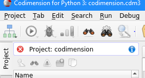
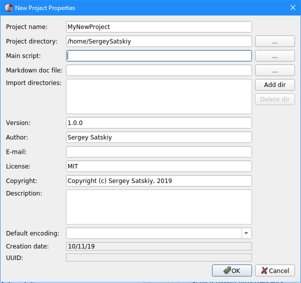
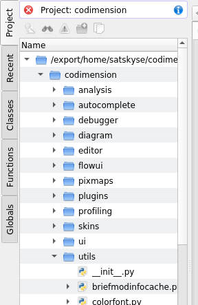

Project
=======

Codimension supports working with and without a project.

If there is no project then all open files are treated as independent with no
relation to each other. Some IDE functionality will not be available in this
case, e.g. running dependencies diagram for all the python files in a project.

A project in Codimension is a directory and everything below recursively. When
a Codimension project is created there are basically two options:

- Specify a non-existing directory. In this case Codimension will create the
  directory.
- Specify an existing directory. In this case all the file system structure
  below will be analysed and all the files and directories will be considered as
  belonging to the project.

In both cases Codimension will create the project file in JSON format with the
project properties. The file will be called:

```
<project directory>/<project name>.cdm3
```

To create a project use the main menu `Project -> New project` option.
After confirming the project creation Codimension will load it. The currently
loaded project name is shown in the project tab, look at the top bar:



The project bar has two buttons. One is for unloading the project and the other
is for viewing or editing the project properties.

The project creation dialog looks as follows:



Basically it is a set of input fields to provide the project properties.

| Input field        | Description |
|:-------------------| ----------- |
| Project name       | Mandatory. The project name |
| Project directory  | Mandatory. The project directory |
| Main script        | Optional. If provided it must be a python script. It will be used when project debugging or profiling is invoked. |
| Markdown doc file  | Optional. If provided it must be a markdown file. It will be shown when a project documentation is requested. |
| Import directories | Optional. A list of directories where the python files are located and available for non-relative importing from the other project files. It is used when Codimension resolves imports to files (e.g. for dependencies diagram). |
| Version            | Optional. The project version. |
| Author             | Optional. The project author. |
| E-mail             | Optional. The author e-mail. |
| License            | Optional. The project license. |
| Copyright          | Optional. The code copyright. |
| Description        | Optional. The project description. |
| Default encoding   | Optional. The project default encoding. It is used e.g. when a file is opened for editing. |
| Creation date      | Automatically generated, not for editing |
| UUID               | Automatically generated, not for editing |

Almost all the project properties are available for substitution in the project
new file template. Such a template can be created separately.

The project UUID is used to identify a project. For each project Codimension
creates a directory at

```
~/.codimesnion3/<UUID>/
```

where all the project environment is stored, e.g. search history, currently opened
files and positions in them etc.

When a project is loaded Codimension populates the project tab with all the
project files:



Also, the Classes, Functions and Globals tabs are populated with all corresponding
items from all the project files. Those tabs have search facilities which let to
quickly find and jump to the appropriate place in the code.

No manual actions are required when new files are added to or removed from a
project. Codimension watches the project directories for changes and updates
the project tabs accordingly. The new files can be created in the IDE or
copied/created using the other ways outside of the IDE. The same is applied to
the file or directory removal.

