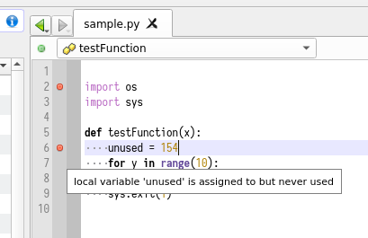
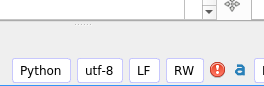
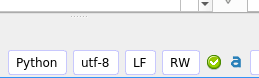

Analysis: Pyflakes
====================

Codimension integrates the pyflakes python package
([github repository](https://github.com/PyCQA/pyflakes))
to quickly check python code.

The pyflakes checks are working automatically so there is no need to invoke
it explicitly. Codimension detects pauses in typing and re-checks the code
if necessary.

The check results appear for the current editing buffer in two ways:
- Each pyflakes message is shown on the editor margin
- All pyflakes messages are shown at the Codimension status bar

This is how pyflakes messages appear on the editor margin:

Each message is associated with the line number so a red dot icon appears at
the appropriate line. When a mouse cursor hovers the pyflakes message icon a tooltip
with the full text appears.

This is how the status bar report looks like:

If there are any pyflakes messages then the status bar displays a red exclamation
sign icon. The icon supports double click: the cursor will jump to the first line
pyflakes has a message for. A context menu is also supported. All the pyflakes
messages sorted by the line number will appear. Selecting an item will move
the cursor to the corresponding line.

If pyflakes has no messages for the current editing buffer then a green icon will
be displayed instead.

