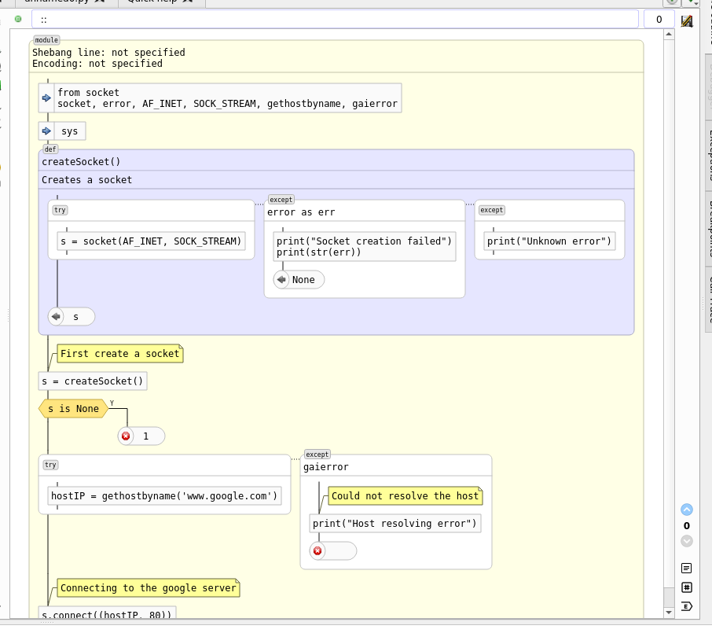
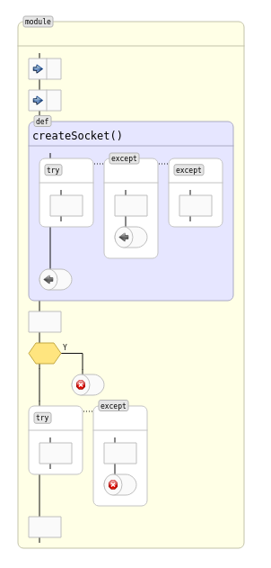
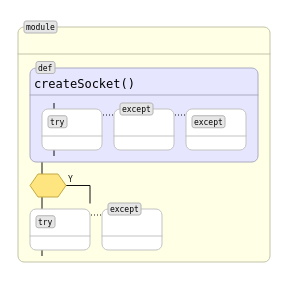
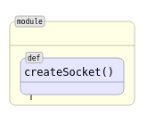
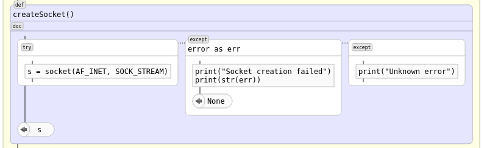
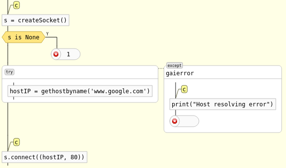
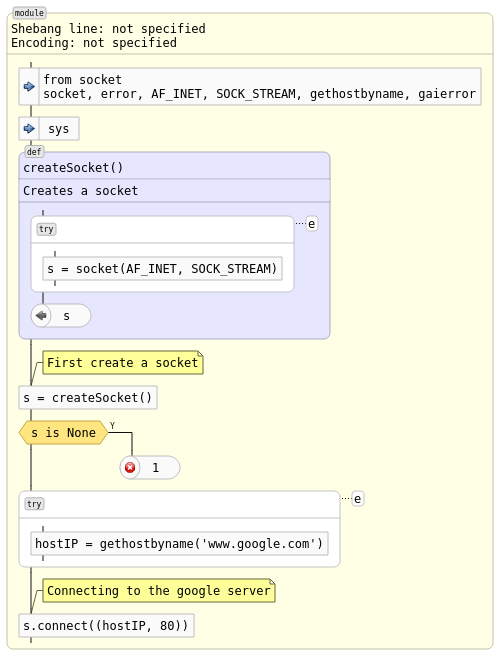

Traditional and Smart Zoom
==========================

Codimension supports two types of zoom on the graphics pane for python code:
- Traditional zoom or simply zoom
- Smart zoom

Traditional Zoom
----------------

The traditional zoom just scales all the elements on the diagram. The scaling
is font based. Each zoom step increases (or decreases) the current font size
by one point, then the sizes of all elements are re-calculated and the
diagram is redrawn.

To invoke the traditional zoom the following ways could be used when the focus
is on the graphics pane:
- Keyboard shortcuts: 'Ctrl' + '-' and 'Ctrl' + '='
- Keeping the 'Ctrl' keyboard button pressed rotate the mouse wheel

Smart Zoom
----------

The Codimension smart zoom feature distinguishes a few smart zoom levels and
they are numbered starting from 0.

The UI to control the smart zoom level is at the right bottom of the graphics
pane. There are two buttons with arrows up and down, plus the current level
number between them. Hovering the mouse cursor over the level number brings up
a tooltip with a hint of what is shown on the current level.

The number of levels may be extended in the future. So far there are four levels
available.

Smart Zoom Level 0
------------------

Level 0 shows everything what is found in the source code.

Smart Zoom Level 1
------------------

Level 1 shows the same set of elements on the generated diagram as level 0 
but the text inside the boxes is suppressed. The same source code on level 1
will look as follows.

Smart Zoom Level 2
------------------

Level 2 reduces the number of elements on the generated diagram. The scope items
(like classes, functions, loops) are shown as well as if elements. The other items
are suppressed.
Note: the decorator scopes are not shown either.

Smart Zoom Level 3
------------------

Level 3 reduces the number of shown elemnts further. The only classes and functions
are shown.

Other Display Options
=====================

In addition to the smart zoom Codimention offers an independent UI to control
whether to show individual elements on the diagram. Below the smart zoom control
buttons there are three radio buttons:

- show/hide docstrings
- show/hide comments
- show/hide except blocks

Let's use the same source code to illustrate what changes in displaying are
to be expected.

The hide docstrings button for the example will make a difference only for
the function `createSocket()`.

On the picture above the docstring section has been collapsed and a small
icon appeared instead. The icon has a tooltip with the original text of the
docstring.

The hide comments button will make changes with all the comments.

All the comment elements were replaced with a smaller element with eactly one 
character `c`. These smaller elements also have tooltips with the original
comment text.

The hide exception button will suppress all the except blocks as follows.

All the except block scopes together with their content have been replaced with
a small element with exactly one character `e`. Their tooltips will show the types
of the handled exceptions.

