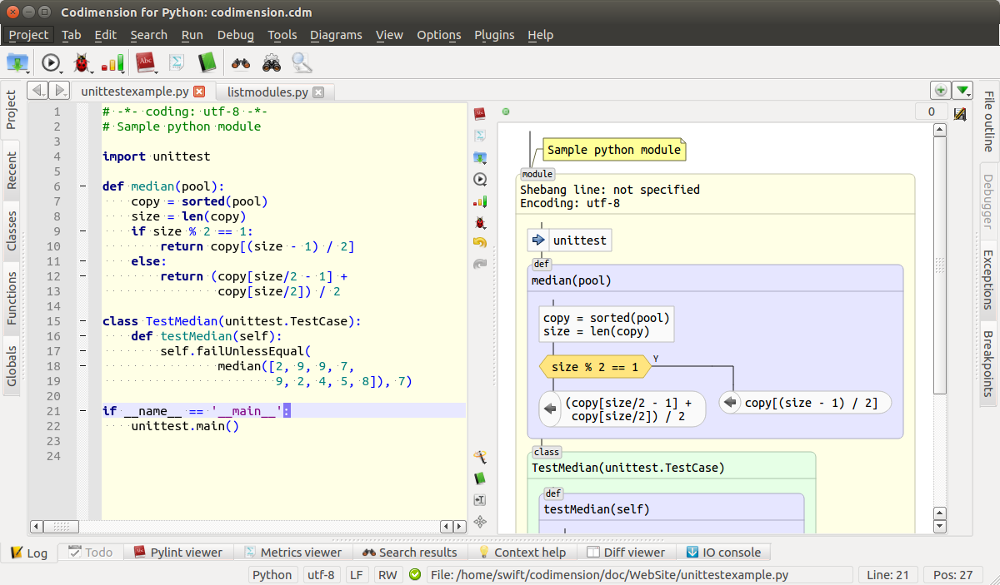
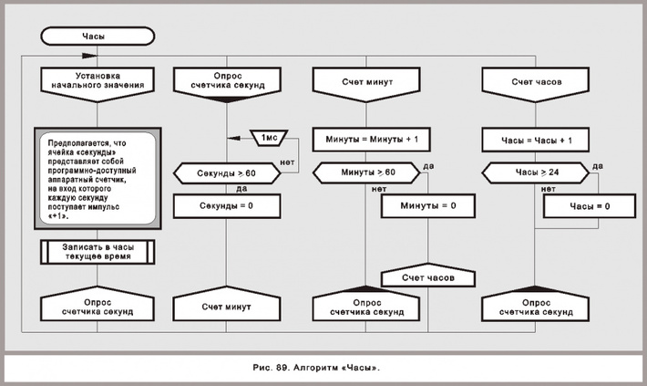
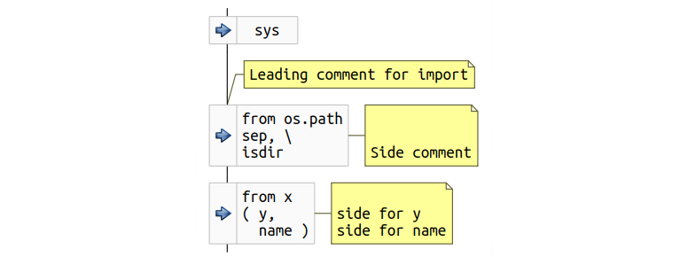
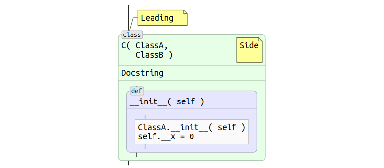
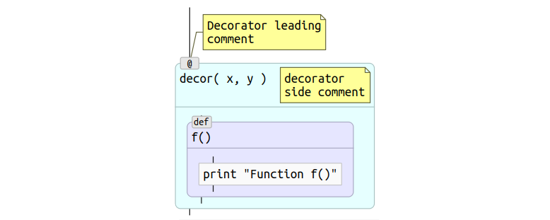
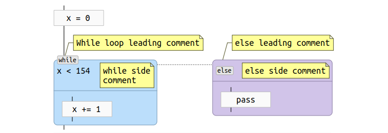
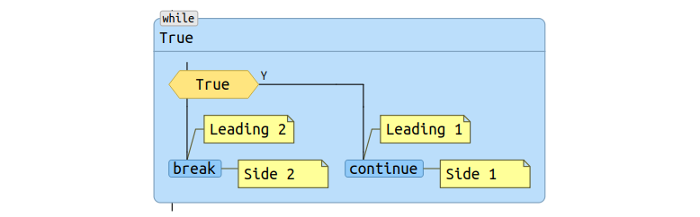
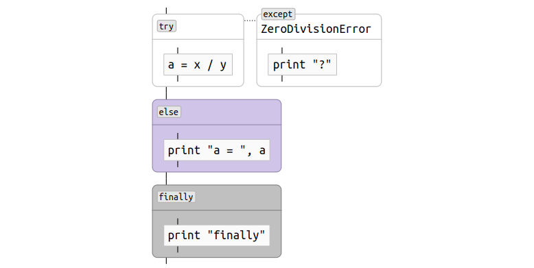
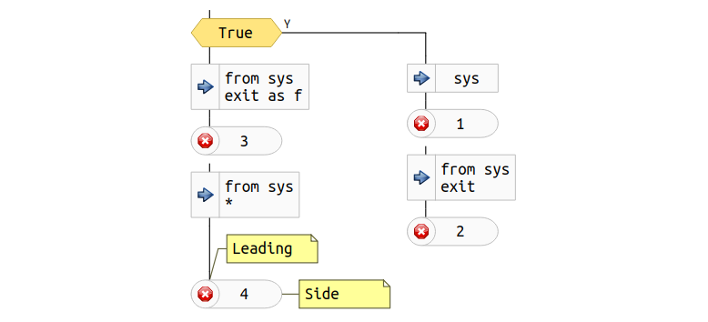
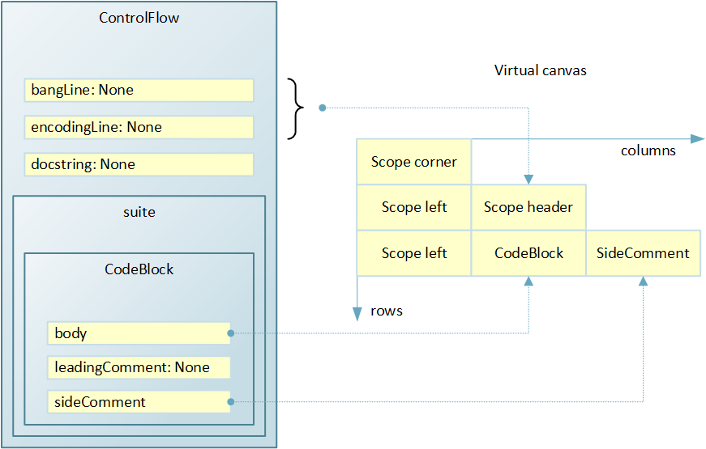

Visialization Technology
========================

Introduction
------------

The technology makes it possible to implement developer tools similar to the 
shown below.



*Common view of an IDE with two ways of representing the code*

The IDE window above is split into two parts. A usual text editor resides on
the left hand side and on the right hand side there is an automatically
generated flowchart-like diagram. The generation and redrawing happen while the
user is changing the source code. The IDE detects a pause in typing and updates
the diagram if the code stays valid. The result of this approach is that the
user can work not only with the text but with its graphics representation as
well.

However, before digging into the details of the suggested technology let’s
discuss some general questions of the software development.

###Flow Charts in the Wild


The most essential related question is: do we need flow charts at all?

My experience of software development clearly shows that flowcharts are used
and the way they are used depends on a certain task. Two typical scenarios
could be recognized:

- developing new software from scratch
- supporting existing software which in most cases is developed by somebody else

In both scenarios I use diagrams, though in different fashions.

In the case of a new development it is usually a top-to-bottom approach. I draw
the architecture of the future software as a set of abstract blocks or actors
and then I move to more detailed levels eventually reaching the level of the
chosen programming language. Certainly, I do not draw everything. I draw only
the parts which are of interest to me or the most difficult ones. Unfortunately,
tools available on the market, like MS Visio for example, help me only when I
work on a high abstraction level. I wish there was a tool which would help me
with the lower level too, and preferably in two complementary ways: generating
a diagram from code and vice verse.

In the case of maintaining existing code it is the usual - and sad - situation
that there is no documentation and I have to reverse engineer the ideas behind
the code. So I proceed in a bottom-to-top way. I read the code and when I
understand what a chunk of it does I draw  physically on a piece of paper or
mentally - a block with an appropriate label on it. Thus I get a single block
(or a chunk) with a label instead of a group of statements. Eventually I get
a flowchart which corresponds to the code. I wish there was a tool which
supports this process conveniently but I have not found it yet.

It also makes sense to consider large scale industrial projects which relied on
flowcharts or similar diagrams heavily, if not entirely during the development
stage. Are there such projects? The answer to this question is yes and it comes
from rocket science. Probably the largest project I am aware of that used
flowcharts is the software for the Russian space shuttle called Buran. Unlike
the US space shuttles, the Russian one was unmanned and the software did all
the work on the way to space and back. During the whole software development
process the developers used the programming language called DRAKON and the
language uses flowchart-like diagrams on all stages. The developers could not
use text at all.

The project proved to be very successful: Buran reached space and came back
safe and sound. The reports claim that the low level of software mistakes in
the project and the speed of development are due to the chosen approach of
using diagrams instead of text. A similar approach is still in use for some
space related projects as far as I know.

Unfortunately, modern developers who are using popular programming languages
at work cannot use DRAKON due to some constraints of the technology. However,
a general conclusion could be made: diagrams, similar to flowcharts are useful
and could bring a significant benefit.



*Example of a DRAKON diagram (from drakon.su)*

###Available Tools

My understanding of the software engineering is that sometimes it makes more
sense to work with the code in a text editor while sometimes it is graphics
which delivers the best performance. So ideally I would like to have a tool
which supports both: text and graphics, without sacrificing any of the two ways
to look at the code. That ideal tool would also provide a smooth and integrated
way to switch between the views of the same code.

Sadly there is no such a tool on the market yet. There are generic engineering
graphics tools like Dia or MS Visio which are very good at what they are
designed for. They can help at some stages but it is hard to use them when
there are frequent changes. There are tools which support a design stage - e.g.
UML oriented tools - but it is hardly ever possible to use them on a lower
level. There are code generators but the generated code in many case is not
really for reading it. There are graphics tools - like DRAKON oriented
ones - used in their specific application domains but they cannot be used in
the general purpose modern projects. They usually sacrifice the text and
concentrate on drawing or even do not provide access to the text at all.

So if a suitable tool does not exist then probably it’s worth to develop a
technology which opens a possibility of creating it. The further discussion
will be about the technology and an experimental IDE implementing it. The IDE
lets to look at the existing projects as at text and as at graphics with an
automatic synchronization between the views. The implementation is done for
Python and mostly in Python.


##Graphics Primitives

A good start point for the discussion could be a set of graphics primitives
that will be used to represent an arbitrary python code. Let's talk first of
moving from text to graphics. At the beginning we have a file with some Python
code and at the end we need graphics primitives, appropriately drawn and
connected. The following questions need to be answered at this stage. What
language elements should be recognized? How exactly the recognized elements
should be drawn on a flowchart-like diagram?

The next chapters will discuss all the required graphics primitives one by one.


###Code Blocks

Certainly not all the language statements affect the control flow directly.
The statements which do not affect it could be drawn as code blocks.

Why blocks but not just individual statements? Well, developers tend to group
statements into chunks which help to understand the code for the future readers.
The chunks are separated from each other with blank lines. This commonly used
technique should be respected and reflected on a flowchart diagram.

As for the graphics primitive shape, a plain rectangle seems to be very
reasonable for a code block. The examples below show a single code block and a
couple of blocks one after another. The only difference in the code of the
examples is a blank line between the statements (here and further: each example
has a piece of Python code followed by its suggested graphics representation).

```python
c = MyClass( 154 )
c.member = f( 17 )
c.doSomething()
print c
```


*One code block*

```python
c = MyClass( 154 )
c.member = f( 17 )

c.doSomething()
print c
```


*Two code blocks one after another*


###Comments
If a closer look is taken, it is easy to notice that a few types of comments
could be identified basing on how a developer located the comments in the code.
Similarly to the code blocks, empty lines should be respected because they
define chunks of information. The three comments types are:

- Independent
- Leading
- Side comments

The independent comments are those which occupy one or many lines and separated
from anything else by at least one empty line. The independent comment lines do
not contain anything but comments.

The leading comments are quite similar to the independent ones with one
exception. The very next line after a leading comment is a Python statement.
A developer did not insert an empty line between the comment and the following
block and most probably this is meaningful - the comment is for the following
block.

The side comments are those which are located to the right of the statements.
There are a few important details about side comments. A code block may occupy
a few lines and a developer may want to provide a comment only for a certain
line in the block. This fact should be respected. Another detail is that
sometimes a developer may want to provide more than one line of comments for
the last statement in a code block. Cases like that should also be respected
in graphics.

Theoretically it is possible to introduce a trailing type of comments -
similarly to the leading type with the difference that there is no empty line
between a statement above and the comment. This however seems to have a very
minor practical sense. Developers rarely comment on something which is located
above. They rather use a leading comment or a side one. Therefore it was
decided not to introduce a trailing type of comments.

So, how could these three distinguished types of comments be drawn on a diagram?


###Independent Comments

```python
a = 154

# Line 1
# Line 2

b = a
```


*Independent comment*

An independent comment in the example above is comprised of two lines. Indeed
the comment is between two code blocks and that position corresponds to a
connector between the blocks on the diagram. So a reasonable graphics for
independent comments would be a note rectangle with a horizontal connector
to the appropriate inter block connector.

###Side Comments

```python
a = 154
b = a       # No comment for the first line
c = b + 1   # Comment for c
            # A tail -----^
```


*Side comment with a "tail"*

The side comments require to pay attention to a couple of things. The first is
that there is usually a line correspondence between the comment and the
statement. In this example the author of the code provided a comment only for
some statements in the code block. Therefore the graphics representation must
keep the line-to-line correspondence between a drawn code block and its side
comment.

The second thing to consider is a tail of a side comment. Sometimes a side
comment for the last code block statement takes more than a single line as is
in the example. The last comment line looks like an independent comment because
it does not have a statement before the # character however the author wanted
the comment to be for the last statement in the block. A criteria to consider
the side comment to be continued on a separate line could be as follows:

- the comment continue line is the very next one and
- the # character is at the same position in the line as in the line above


###Imports

Essentially imports denote dependencies. The dependencies in their turn can
become very difficult to control in large projects. So it would be valuable if
a graphics primitive for imports draws attention to the important detail of a
Python module even at a quick glance at the diagram. Bearing in mind this
reasoning the chosen graphics primitive has an icon on the left as shown below.

```python
import sys

# Leading comment for import
from os.path import sep, \
                    isdir       # Side comment

from x import ( y,         # side for y
                name )     # side for name
```



*Imports*

The second and the third imports in the example occupy more than one line and
some of the lines also have side comments.


###If Statement

Let’s discuss how the if statement should look on a graphics diagram. A
traditionally recommended shape is a diamond. The diamond shape probably works
just fine if a condition is very short. In practice, however, a lot of code has
complicated and quite often multilined conditions which are hard to squeeze
into a reasonably sized diamond. The diamond will either occupy too much
precious vertical space on the screen or the font size will be too small if
readable at all or the original condition text needs to be shortened. So the
suggestion is to use compromise graphics which have the left and right edges
resembling a diamond with the top and bottom edges flat to better use the 
screen pixel estate. That shape can be easily and naturally scaled to
accommodate a condition of an arbitrary complexity.

The second thing to discuss is how to draw the yes and no branches. One of the
alternatives here would be to draw them as shoulders on the left and right of a
decision block. However, this may lead to a diagram which is hard to read and
which does not look nice. The problem comes from the fact that the branches may
have arbitrary complexity and in graphics it may lead to very wide shoulders
thus shifting the decision block to the right. Consequently it may make browsing
the diagram inconvenient because both, the vertical and horizontal scrolling
would be required.

One more consideration is about designing the code the way it would be easier to
read and understand it later on. It would be nice if there is a way to reside
all the actions related to the main purpose of the program on one vertical axis
while an unavoidable error and special cases handling would be on a side. Then
if the original author took care of it, the others would understand the code
quicker. Therefore, to support such a style of coding it was decided to draw the
branches as follows: one of them to draw directly under the decision block and
the other - to the right of it.

```python
if 154 > 153:
    print "Well, yes"
else:
    pass
```


*If statement example*

Obviously, the author may provide comments for various pieces of code related
to the if statement. Let’s consider a more complicated example.

```python
# Leading for ‘if’
if ( 154 > 153 and        # Side 1
     1 > 0 ):             # Side 2
    print "Well, yes"
# Leading for ‘else’
else:
    pass
```


*If statement with comments*

The example in particular has side comments for the condition. Similarly to what
was noted for the code block side comments, the condition side comments could be
provided only for certain lines. So the condition side comment has to be to the
right of the condition and has to be aligned vertically with it. Sadly, no good
option was found to avoid crossing connectors on the graphics. There is however
a mitigating circumstance - in practice the condition side comments are used
rare. In the vast majority of cases developers prefer to use leading comments.

The last interesting detail is about a leading comment for the else part. The
graphics does not have any designated primitive for else. In fact else is
represented as a connector. So the leading comment for else looks exactly as an
independent comment. However there is nothing damaging here. The graphics still
represents the code correctly.


###Functions

A Python file may contain many function definitions and even nested function
definitions. A commonly accepted graphics for the flowchart diagrams however
does not offer anything well suitable for the real life Python functions. So
something new needs to be suggested.

When functions are discussed it quite often goes along with the idea of scopes.
A scope plays a role of borders space with well defined borders. Certainly a
function has very definitive points where it starts and where it ends. So the
graphics for a function may use a sort of a closed area within which a function
body is drawn. Let’s take a moment and recall a familiar situation. Someone
looks at a piece of somebody else’s Python code and has troubles understanding
the context. A statement may belong to a function, to a class member, to a
condition branch or to a loop body etc. The idea of a rectangle area with
explicitly drawn borders may help to understand the current context quicker.

Let’s consider an example of a simple function definition and the suggested
graphics for it.

```python
def f( x ):
    print "Function f( x )"
```


*A simple function definition*

The function is within a rounded rectangle which is filled with a color
specific for functions. The rectangle has a header where the function name and
the arguments reside. The function body resides below and is separated from the
header with a horizontal line. To make it more obvious that the scope is for a
function the rectangle is augmented with a badge in the upper left corner.

Sometimes the real world Python functions might be a bit more complicated. They
may have a leading comment, a docstring, the arguments may also have comments
and may occupy many lines. Here is another example below for a function
featuring the mentioned items.

```python
# Leading comment
def g( x,     # x - first argument
       y ):   # y - second argument
    """ Docstring """
    print "Function g( x, y )"
```


*Function with a docstring and comments*

The leading comment graphics is obvious while the side comments one brings a
problem of where to draw it on the diagram. The most important consideration
here is that the side comment lines must be aligned with the lines in the
function prototype. Therefore it was decided to draw it within the function
header. It is hard to call this decision the best because it may look as a
pollution of the function header space. However this approach covers all the
cases of the correct Python code and does not leave space for ambiguities.

To accommodate docstrings the header is extended with one more horizontal
section which follows the prototype section.


###Return Statement

The flowchart diagrams offer a nice graphics for the return statements and this
shape could be used with a minor improvement. Let’s take a simple example.

```python
def f( x ):
    return x * 154
```


*Simple return statement example*

The improvement is an icon added to the left part of the primitive. The reason
to add the icon is the importance of the return statements from the control
flow point of view. The icon serves the eye-catcher purpose even if only a
brief look at the diagram was taken.

Similarly to the other language elements the return statements may occupy more
than one line and may have both leading and side comments. An example below
shows how the suggested graphics can be scaled for such cases.

```python
def f( x ):
    # Return leading
    return ( x * 154 +    # Side 1
             x / 154 )    # Side 2
```


*Return statement with comments*


###Classes

Coming from functions to classes, it seems only logical to use the same idea of
scopes for classes. The class graphics layout could be very similar to the
function's one with an exception of a background color and a text in the badge.
An example below demonstrates a class with comments and a docstring.

```python
# Leading
class C( ClassA,      # Side
         ClassB ):
    "Docstring"
    def __init__( self ):
        ClassA.__init__( self )
        self.__x = 0
```



*Class graphics*


###Decorators

One more Python entity which may appear in the context of Python functions and
classes is a decorator. Essentially a decorator is a wrapper function so a scope
idea could be used for decorators too. To facilitate a quick context
identification a distinctive background color and a distinctive badge should be
used on the decorators graphic. Here is an example.

```python
# Decorator leading
# comment
@decor( x, y )      # decorator
                 # side comment
def f():
    print "Function f()"
```



*Decorator with comments*


###Loops

Python supports two types of loops: for and while. Both of them have a
condition, may have break and continue statements inside as well as probably
the Python unique else part. The decision of what graphics to use for loops was
not an easy one and based on the following considerations.

A traditional flowchart loop primitive is already used to draw the if
statements and it seems best to keep it this way because there are no good
alternatives for the ifs.

On the other hand a loop has a very definitive point where it begins and where
it ends so it reminds a scope for the loop body with a loop condition in the
scope header. Another consideration is that the idea of having all actions
related to the main purpose of the program on the same vertical line is
expressed better in case of a scope primitive. This is because a scope is
represented by a closed geometrical figure with the entry on the top and the
exit at the bottom. The traditional graphics on the contrary has the entry at
the top and the exit on the right.

The next problem with the traditional graphics is that a Python loop may have
an else part which does not fit the traditional graphics at all.

The last consideration is the break and continue statements. If a scope
primitive is used then the points to where break and continue should lead
become very well visible: at the bottom and at the top of the rounded rectangle.
Otherwise explicit connectors would be required and it would be hard to draw
them automatically without crossing the other primitives or connectors if the
loop body is complicated.

The usage of the scope idea for the loops also resolves the question with the
location of leading and side comments easily. So it was decided to stick on the
scope primitives for Python loops.

```python
for x in [ 1, 17, 42, 154 ]:
    print x
```


*For loop*


A more elaborated example below features leading and side comments as well as
an else part.

```python
x = 0
# While loop leading comment
while x < 154:     # while side
                   # comment
    x += 1
# else leading comment
else:              # else side comment
    pass
```



*While loop with else part and comments*


The else part has its own scope and is drawn at the right hand side. To
emphasize the association between the loop and the else part the graphics has a
dotted connector between the scopes. Both the leading a side comments are shown
in a way similar to what was done for the other scopes. The last detail is that
the else part badge was moved into the header area because there is nothing to
draw there and it seems to look better this way.


###Break and Continue

Traditional flowchart diagrams do not offer any graphics for the break and
continue statements. These statements correspond to connectors and that
introduces a potential problem. Both break and continue statements may have
comments tied to them and it would be hard to show comments distinctive enough
to highlight that fact. Another problem is that the logic of a loop body could
be very complicated and there could be many continue and break statements. In
those cases it is very difficult (if possible at all) to draw the connectors
with minimum turns and not crossing the other connectors. Usually crossings and
excessive number of connectors lead to a diagram which psychologically treated
as a messy one and which is difficult to understand. So it would be nice to
keep the diagram as clean as possible.

To resolve the problems it was decided to introduce new graphics for the break
and continue statements. To highlight that they are essentially jumps to certain
points a graphics resembling a label was chosen. It was also decided that the
labels would not have an outgoing connectors as a Python developer definitely
knows anyway where continue and break will jump to.

```python
while True:
    if True:
        continue
    else:
        break
```


*Break and continue*


Certainly break and continue could have comments. An example below demonstrates
how they could be drawn unambiguously showing what statement they belong to.

```python
while True:
    if True:
        # Leading 1
        continue     # Side 1
    else:
        # Leading 2
        break        # Side 2
```



*Break and continue with comments*


###Try, Except, Else, Finally

This is probably the most complicated language statement. It may have try, many
except, finally and else blocks. As soon as all these parts have their own suits
it was decided to use the idea of a scope for each of them.

```python
try:
    a = x / y
except ZeroDivisionError:
    print "?"
else:
    print "a = ", a
finally:
    print "finally"
```



*Try-except-else-finally example*


The except scopes are for error handling which are usually not on the main path
of a program execution. That is why they are on the right hand side. The else
and finally blocks on the other hand are rather on the main line of execution
so they are right under the try block. The except blocks have a dotted connector
to the corresponding try block. This is done to emphasize the relationships
between them. If there are more except blocks, then they will be one after
another on the right hand side.

There is not much more to say about the try statement. Obviously each element
could have both leading and side comments and if so then the comments will be
shown the very same way as for the other statements which use the scope shape
graphics.


###With

The with statement defines a context in which its suit is executed. Thus the
idea of a scope for the with statement looks very appropriate.

```python
# Leading
with open( "my-data.txt" ) as f:    # Side
    data = f.read()
    print data
```


*With*


###Raise

Undoubtedly, an exception generation affects the control flow considerably. So
the graphics for it should be identifiable at first glance. The other
consideration is that there is a similarity between return and raise statements.
Both lead the control flow out of the current scope. So it was decided to use
the shape from the return statements and to add a red arrow icon for eye
catching purposes.

As usual the raise statement may occupy many lines and may have leading and side
comments as shown below.

```python
# Leading
raise Exception( "first line "     # Side 1
                 "Second line" )   # Side 2
```


*Raise*


###Assert

Asserts generate exceptions conditionally i.e. they affect the control flow
similarly to the raise statements. That is why it seems reasonable to keep the
same red arrow icon as the raise statements use but to highlight a conditional
nature of asserts.

```python
assert x == 97

# Leading
assert type( x ) is IntType, \
       "x is not an integer"     # Side
```


*Two assert statements*


The conditional nature of the assert statements is shown via a diamond shape on
the left which shares the icon with the raise statements. Certainly asserts may
have leading and side comments and this case is covered by the second statement
in the example above.


###sys.exit()

Strictly speaking the sys.exit() call is not a part of the language but a
library function. It however affects the control flow no less than exceptions
and probably even severer. So the idea of recognizing the sys.exit() calls and
highlight them explicitly looks attractive and valuable.

A peculiar detail here is that the sys.exit() could look different depending on
how the corresponding import is done. An example below demonstrates the
suggested graphics and various ways to import sys.exit().

```python
if True:
    import sys
    sys.exit( 1 )

    from sys import exit
    exit( 2 )
else:
    from sys import exit as f
    f( 3 )

    from sys import *
    # Leading
    exit( 4 )    # side
```



*sys.exit() example*


Of course there is a possibility to call sys.exit() through the eval("...")
call as well and it is very difficult (if possible at all) to cover this case.
In practice however handling the most common cases is better than nothing.

The sys.exit() call prematurely finishes the program execution i.e. could be
considered as a return which passes by all the intermediate levels. So the
graphics shape for sys.exit() is borrowed from the return statements with a
specific icon which reflects the nature of it.


###File

The last required primitive is for a file. A Python file has a few attributes
which should be shown. Namely, a file may have:

- a docstring
- an encoding line
- a hash bang line

Naturally, a file forms a scope within which all the other items are located.
So a scope primitive could be used once again.

```python
#!/usr/bin/env python
# encoding: utf-8

"""
A file docstring may occupy
a few lines
"""

print "Hello flowcharts"
```


*Python file*


##Proof of Concept: Codimension Python IDE

So, having a good idea of what information should be collected from a source
code and how to draw it, a tool development can be started. An important
question at this stage is as follows: how the text and the graphics should
collaborate with each other? One of the options is to support graphics only.
This way was rejected because of two major reasons. The first is that it is easy
to imagine both situations when graphics wins over text and vice verse. The
second reason is that all the typical IT projects infrastructure is tied to
text, e.g. tools to compare between revisions, various search tools etc.

Therefore, the tool should support both ways of the program representation - via
text and via graphics - without sacrificing one of them. In a usual IDE a text
editor occupies the main area so now this area is going to be equally divided
between text and graphics.

Before starting a new project an analysis of existing open source IDE took
place. The idea was to consider development of a plugin - in opposite to
developing a whole tool - which adds graphics capabilities to an existing
project. Unfortunately nothing suitable was found. So a new experimental
project called Codimension Python IDE was started.


*Common view*

Codimension was not started from an absolute scratch. Some ideas and code have
been taken from another open source Python IDE called
[Eric 4](http://eric-ide.python-projects.org/).

At the moment Codimension implements an automatic drawing of a flowchart diagram
for an arbitrary Python (series 2) code. A pause in typing code is detected and
the diagram is automatically re-drawn on the right hand side. If the code
becomes broken at some stage, the diagram is simply not updated and an indicator
on the top tells about the current state.

Also a feature of showing a navigation-like path for a scope under the mouse
cursor is implemented. A double click on the diagram is also supported: the
focus is passed to the text editor part and the corresponding line is set as
the current one. The opposite way of synchronizing the views is supported via a
hotkey combination. When the user invokes it the IDE detects what graphics
primitive corresponds to the current line in the text editor and scrolls the
graphics view appropriately. The features of zooming and exporting to an SVG, a
PDF and a PNG are implemented as well. Obviously, not all the IDE features are
mentioned here and more features are planned for the graphics view.

Now, let’s talk about the implementation details.


###General Information

[Codimension](http://codimension.org/) is implemented as an open source project
licensed under GPL v.3 and its source code resides in three repositories on
[github](https://github.com/): two Python extension
modules [cdm-pythonparser](https://github.com/SergeySatskiy/cdm-pythonparser)
and [cdm-flowparser](https://github.com/SergeySatskiy/cdm-flowparser) plus the
[IDE](https://github.com/SergeySatskiy/codimension). The extension modules
are mostly written in C/C++ while the IDE is written in Python. The UI is
implemented using Python QT library bindings - PyQT.

The development is done on Linux and for Linux. In particular Ubuntu
distribution was used most of the time.

The IDE targets projects written in Python 2 (update: the current Codimension versions are for Python 3).


###Architecture

The diagram below shows the most important components of the IDE.


*IDE architecture*

Blue highlights the parts developed within the Codimension project. Yellow is
used for third party Python written modules and green denotes third party binary
modules.

It was obvious from the very beginning that one developer is not able to develop
all the required components from scratch within the reasonable timeframe.
Therefore the existing Python packages were used where it was possible and
reasonable. The diagram above reflects this approach quite well.

Only three parts are developed for the project. The IDE is written in Python to
speed up the development and to make it easier to experiment. The extension
modules are written in C/C++ to have a better performance. The purpose of the
brief parser is to report all the entities found in a Python file (or a buffer),
e.g. imports, classes, functions, global variables, docstrings etc. This
information lets to implement features like:

- A structured view of a file content and navigation through it
- Analysis of defined but never used global variables, classes and functions
- etc.

The flow parser purpose is to provide a Python file (or a buffer) content in a
way convenient for drawing a diagram.

All the other components are third party. The PyQT bindings were used for the UI
and network parts. QScintilla played the role of a text editor component and
also was used in a redirected I/O console and in an SVN blame widgets. Graphviz
was used to calculate graphics layout of a dependency diagram and some others.
Also many third party pure Python packages were used: pyflakes, pylint,
filemagic, rope, gprof2dot etc.


##Code to Graphics Pipeline

An implementation of the transition from text to graphics is built as a
pipeline. Each stage of the pipeline is responsible for a certain piece of work
and the results are passed to the next stage. A diagram below shows all the
pipeline stages. The input - a text - is on the left hand side and the output -
a graphical representation - is on the right hand side.


*Code to graphics pipeline*

The process starts with parsing the source code into a syntax tree. Then the
syntax tree is analyzed and all the code blocks, functions, classes etc are
created as a hierarchical data structure. Then there is another pass over the
source code to collect comments. After that the comments and the recognized
language elements are merged into a single data structure. The merge is done
because it is more convenient to have comments already associated with the
corresponding language elements on the further stages. The described above
actions are done in a flow parser Python module which is written in C/C++ to
achieve the best possible performance.

The further stages are written in Python and reside in the IDE. This allows
better flexibility and ease of experimenting in comparison to a C++
implementation.

At the beginning all the recognized elements are laid out in accordance to the
flow parser output in a data structure called a virtual canvas. After that the
virtual canvas goes through rendering. And finally all the graphics elements
are drawn on the screen appropriately.

Let’s discuss all these stages in details.


###Syntax Tree

This is the very first stage on the way from text to graphics. The purpose of
the stage is to parse the source code and to build a hierarchical data structure
which represents the text. Building a syntax tree and then walking it helps to
make the implementation of the stage easy. Obviously there was a wish not to
develop one more Python parser specifically for the project but to use one
already developed. Fortunately, the Python interpreter shared library has a
suitable function. It is a C function which builds a syntax tree in memory for
the specified Python code. To make the tree easy to analyze a utility which
prints the tree nodes was written. Here is an example of a source code and its
syntax tree.

```python
#!/bin/env python
# encoding: latin-1

def f():
    # What printed?
    print 154
```

The following tree is built (fragment only to avoid polluting):

```shell
$ ./tree test.py
Type: encoding_decl line: 0 col: 0 str: iso-8859-1
  Type: file_input line: 0 col: 0
    Type: stmt line: 4 col: 0
      Type: compound_stmt line: 4 col: 0
        Type: funcdef line: 4 col: 0
          Type: NAME line: 4 col: 0 str: def
          Type: NAME line: 4 col: 4 str: f
          Type: parameters line: 4 col: 5
            Type: LPAR line: 4 col: 5 str: (
            Type: RPAR line: 4 col: 6 str: )
          Type: COLON line: 4 col: 7 str: :
          Type: suite line: 4 col: 8
            Type: NEWLINE line: 4 col: 8 str:
            Type: INDENT line: 6 col: -1 str:
            Type: stmt line: 6 col: 4
            . . .
```

Each line of the output corresponds to a tree node and the nesting level is
shown via indentation. Also all the collected node information is shown.

Generally the tree looks nice: there are line and column numbers, the node types
correspond to the formal Python grammar specification. However there are some
problems too. First, the source code had comments but the tree has no
information about them. Second, the encoding line and column information does
not reflect the reality. Furthermore, the source code had latin-1 encoding but
the syntax tree reports iso-8859-1. In case of multiline string literals there
is a problem as well: the tree has no information about line numbers. All these
surprises had to be taken care in the module implementation. It however seems a
minor obstacle in comparison to the complexity of a full fledged parser.

The flow parser module defines types which will be available in the Python code
on the further stages. The types correspond to all the recognized language
elements, e.g. Class, Import, Break etc. Each type has some specific attributes
in addition to the common properties: all the types basically describe elements
in terms of fragments: where a piece of text starts and where it ends.

The formal output of the tree walking stage is an instance of the ControlFlow
class which has all the recognized elements stored hierarchically.


###Collecting Comments

Due to the fact that the comments are not in the syntax tree (obviously, the
Python interpreter does not need them) but they are needed for a lossless
representation of the code, another pass over the source code is required. The
pass collects information about each line of the comments. It is quite easy to
do thanks to a simple Python grammar and an absence of multilined comments and
a preprocessor.

The comments are collected as a list of fragments where each fragment describes
one line of a comment via a set of attributes: line and column numbers of the
start and the end of the comment as well as their absolute counterparts.

For example, the code:

```python
#!/bin/env python
# encoding: latin-1

def f():
    # What printed?
    print 154
```

Has three comment fragments:

```
Line: 1 Pos: 1 ...
Line: 2 Pos: 1 ...
Line: 5 Pos: 5 ...
```


###Merging Comments with Code

At this moment of the pipeline there are two data structures populated: a
control flow and a list of comments. However when a diagram is laid out it is
more convenient to have one merged data structure because the recognized
elements and their comments are tightly coupled. So the extension module has a
phase of merging the comments and the control flow structure.

Let’s take an example:

```python
# leading comment
a = 10  # side comment 1
        # side comment 2
```


*Merging comments with code*


A syntax tree walk for the code in the example will in particular produce an
instance of the CodeBlock class. The class instance has among the others the
body, leadingComment and sideComment attributes which describe the
corresponding elements in terms of fragments. The body attribute is filled by
the information from the syntax tree while the comment fields are filled with
None initially.

A comment collecting pass for the code in the example will produce a list of
three fragments. During the merging procedure the first fragment is used to
populate the leadingComment attribute while the second and the third fragments
are used for the sideComment attribute. The merge is done basing on line numbers
available from both sources.

So the output of the merging stage is a fully populated hierarchical data
structure which describes a file or a buffer content without any information
loss.


###Module Performance

The pipeline stages described above are written in C/C++ and packaged into a
Python extension module. The idea was to achieve the best possible performance
to avoid irritating delays when a diagram is redrawn which happens in pauses of
typing. To test the performance the module was run on the platform at hand:

- Intel Core i5-3210M laptop
- Ubuntu 14.04 LTS

To process all the files from a standard Python 2.7.6 installation. Having 5707
files it took around 6 seconds. Certainly the file sizes differ and the parsing
time depends on the size however an average result of about 1 ms per file on
not the best ever equipment is more than acceptable. In practice the text which
needs to be parsed is already in memory and it reduces the processing time too.


###Laying Out on a Virtual Canvas

The purpose of this pipeline stage is to allocate all the required elements on
a virtual canvas respecting the relationships between them. A virtual canvas
can be imagined as a surface with rectangular cells. A cell can be empty or have
one graphics element or have a nested virtual canvas. At this stage the only
location of the elements is important but not their precise sizes.

A canvas does not features a fixed size and can grow down and right as needed.
This approach corresponds to the prepared data structure and the way a diagram
is drawn. The process starts from the upper left corner. New rows and columns
are added as needed. For example, when a new code block is processed a new row
will be created. If the block has a side comment then a new column will be
added to the row.

A set of graphics elements used for the virtual canvas cells nearly matches the
set of the language recognized elements. A small extension of the set is
required: e.g. the canvas may need a connector going from top of the cell to
the bottom of it while there is no such item in the language.

An implementation of a virtual canvas uses a list of lists (two dimensional
array) which is empty at the beginning. Let’s take a simple example to
illustrate how the process works.

```python
a = 10    # side comment 1
          # side comment 2
```



*Allocation of graphics elements on a virtual canvas*


The figure above shows a data structure on the left which was formed as a
result of the code analysis. An instance of the ControlFlow class has a few
attributes and a container suite which in turn holds one element - an instance
of the CodeBlock class.

Initially the canvas is empty and the process starts. As it was discussed
earlier a module will be drawn as a scope i.e. as a rounded rectangle. To make
the further graphic element size calculation easier a scope rectangle is split
into pieces: corners and edges. At the top left corner of the diagram there will
be a module scope rectangle corner so a row is added to the canvas and then a
column is added to the row, setting the cell value to ‘scope corner’. There is
no need to allocate the top edge of the module scope rectangle because the
vertical spacing for the elements below is provided by the corner element and
when it comes to actual drawing the whole rounded rectangle will be drawn at the
moment its top left corner is found.

The next step is to process the module header. The module has a hash bang and an
encoding lines. The values of the corresponding attributes in the example are
None but the header needs to be drawn anyway. So a new row is added to the
canvas. The header needs to be drawn within the scope rectangle with some
spacing so the first cell in the row could not be allocated for the module
header. The first cell must be designated for the left edge of the scope
rectangle and the second cell will hold the header. The right edge of the scope
rectangle does not need to be allocated because of two reasons. First, at this
moment it is unknown how many columns there will be in the widest row. Second,
the whole scope rectangle will be drawn when its left corner is found.

The module could have a docstring and in this case another row would be allocated. The example however does not have it so the process goes to the suite container. The first item in the container is a code block. So a row is added and two columns are allocated respectively for a scope left edge and a code block. The example features a side comment for the code block so another column needs to be allocated to the right and set to a SideComment element.

There are no more elements in the suite container so the population of the
virtual canvas content is over. A bottom left corner and a bottom edge of the
module scope could be skipped because of the reasons similar to the described
above. The omitted elements just need to be considered when the sizes are
calculated.


###Rendering

The purpose of this stage is to calculate the sizes of all the graphics elements
which will be drawn on the screen. It is done via visiting all the allocated
cells, calculating sizes and string the calculated sizes in the cell attributes.

Each cell has two widths and two heights: minimally required and actual
measurements which in turn may depend on neighbour cells.

Let’s first discuss how height is calculated. It is done on per-row basis. Let’s
take the second row where a code block is allocated. The assignment takes one
text line while a side comment occupies two text lines. Thus the cell with the
comment will need more vertical pixels when it is drawn. On the other hand all
the cells in a row needs to be of the same actual height to avoid shifting the
cells below. Therefore a simple algorithms could be used: walk all the cells in
a row and calculate individual minimally required height. Then take the greatest
minimal height and use it as an actual height for all the cells in the row.

The story with the cell width is a bit more complicated. From this perspective
there are two kind of rows:

- Those with cell widths which need to be calculated respecting the cell widths
  in a neighbour row
- Those with cell widths which could be calculated independently from the other
  rows

A good example of the first kind of rows is an if statement. The branch which is
drawn below the condition primitive could be of an arbitrary complexity and
consequently of an arbitrary width. The other branch needs to be drawn on the
right and also requires a connector located in a row above. So the width of a
cell with the connector needs to be calculated considering the width of the
rows below.

The widths of the cells in independent rows are calculated as a single pass and
an actual width matches the minimal required.

For the dependent row regions the rendering procedure is more complicated. First
the minimal required width is calculated for all the cells in the region. Then
for each column the actual width is taken as a maximum of the minimum required
of all the cells in the column. Generally the process is similar to what is done
for the height calculation in a row.

The calculations are done recursively for the nested virtual canvases. Also the
calculated sizes respect various settings: font metrics, text padding, spacing
etc. When the rendering stage is completed there is everything ready for drawing
on the screen.


###Drawing

The drawing stage is very simple. Since the implementation uses the QT library
a graphics scene is created of the size calculated on a previous stage. Then a
recursive visiting of all the cells in a virtual canvas is done and for each
cell a graphics scene item is added respecting the sizes and location.

The process starts from the top left corner and the current coordinates are set
to 0, 0. The cells in a row are visited and after each cell is processed its
width is added to the current x coordinate value. When a row is over, the x
coordinate is reset to 0 and the row height is added to the current y
coordinate value.

At this moment the graphics representation of the code is drawn on the screen
and ready to use.


##Present and Future

Now it is time to discuss what functionality has already been implemented and
what could be added in the future.

The list of what has been done is quite short:

- Automatic diagram updates in pauses of typing
- Manual synchronization of the visible text and graphics in both directions. If
an input focus is in a text editor and a hotkey is invoked then the IDE searches
a graphics primitive which corresponds to the current text cursor position and
scrolls the diagram appropriately. Then the primitive is highlighted. The
opposite synchronization direction is done via handling a double mouse click
on a primitive which leads to the corresponding line of code in the text editor.
- Diagram scaling. The current implementation uses the QT graphics scene scaling
feature however it is planned to replace it with scaling through changing the
font size.
- Exporting diagrams into PDF, PNG and SVG. The quality of the export is defined
by the QT library implementation.
- Current scope navigation panel. The graphics uses the idea of a scope
intensively so a typical diagram would have many nested scopes. A navigation
panel shows a path to the scope under cursor in terms of nested scopes.
- Individual switching branch location for the if statements. By default the N
branch is drawn below while the Y branch is drawn on the right. The diagram lets
to switch the branches location using a context menu item.
- Individual replacement of a text in any of the graphics primitives. Sometimes
there is a need to replace a certain primitive text with something else. For
example a condition in terms of variables and function calls could be long and
not obvious while a natural language phrase could describe the situation better.
The diagram lets to replace the displayed text with an arbitrary one and show
the original one in a tooltip.
- Individual replacement of colors for any graphics primitive. Sometimes it is a
good idea to draw an attention to a certain piece of code via highlighting it
with a distinctive color. For example a potentially dangerous part of code can
be highlighted in red or a set of blocks responsible for a common functionality
can be highlighted with a common background. The diagram lets to change the
colors of a background, a foreground and an outline of a primitive.
- The practice shows that the usage of the already available functionality can
change the diagram appearance considerably.

The features that could be added to the existing basis are limited only by the
fantasy. So the only most obvious are mentioned below.

- Automatic synchronization of the text and graphics views when they are
  scrolled
- All the editing operations could be supported on the graphics view so that
  when something is changed on the diagram the text view is updated
  correspondingly. This could include editing text within primitives, deleting,
  copying and pasting blocks.
- Support operations on a group of the primitive. (Update: some group operations
  are implemented in the current IDE version)
- Visualization of the debugging on the diagrams
- Search support for the diagrams
- Printing support
- There could be controls which allow to show or to hide various elements:
  comments, docstrings, classes and functions and loops bodies etc. And when
  they are hidden then the actual content could be shown in tooltips. (Update:
  implemented in the current IDE version)
- Highlighting different kind of imports: system imports, project imports,
  unknown imports.
- Support of additional non-python blocks or pictures on the diagrams
- Smart scaling. It is possible to introduce a few fixed scale levels: all
  items, all but comments and docstrings, only class and function headers,
  dependencies between files in the current directories with a highlight of the
  external dependencies. If these levels are bound to a mouse wheel with a
  modification key then a general information could be retrieved very quickly.
  (Update: implemented in the current IDE version)
- Grouping many blocks into a single graphics primitive and ungrouping them
  back. A group of blocks which are responsible for a common functionality can
  be selected on the diagram and replaced with a new primitive with a provided
  text on it. The only natural limitation here is that the group should have one
  entry and one exit. This functionality can be useful when an unknown code is
  analyzed. When the reader understands what a group of blocks does the
  complexity of the diagram can be reduced via grouping a few blocks and
  replacing them with a single element. For example a new element could have a
  title “MD5 calculation” instead of a few original blocks. Obviously at any
  moment a group could be expanded to see all the details. This feature can be
  considered as adding a third dimension to the diagram. (Update: implemented in
  the current IDE version)


##CML v.1

The features mentioned in the previous section could be split into two groups:

- Features which do not depend on the code
- Features which require to store information related to the code related

Here is a good example of a feature which has no relation to the code: scaling
a diagram. The current scale factor is rather an IDE setting but does not
depend on a certain piece of code.

On the other hand switching the branches location for an if statement is linked
to a certain statement so an information about this connection needs to be
saved. Naturally, when the user opens the very same file two days later the
branches have to be drawn as it was instructed earlier.

Obviously there are at least two approaches of where to store an auxiliary
information. It could be stored directly in a source code file or in a separate
file or even in many auxiliary files. When a decision was made the following
considerations were taken into account:

- Let’s imaging a large project with many developers who are working on the same
  code. It is quite possible that some of them like the graphics code
  representation and use it often while the others use only vim for their
  editing needs. In this case if the auxiliary information is stored in
  separate files then it is quite difficult to maintain consistency of two
  sources. The probability that the consistency is broken at some stage becomes
  very high.
- If the approach of additional files is chosen then they may pollute the
  project files namespace and it requires more efforts when it comes to saving
  changes into a revision control system.
- When a developer adds some kind of markup on the diagram - for example,
  replaces a complicated condition with a suitable phrase in English - it is
  usually done not for fun but to make the program clearer. Generally the
  changes have a value and thus it would be nice to keep that value available
  even for those who have not discovered the graphics representation yet.

These considerations lead to a conclusion: if there is a compact solution to
store the additional markup information directly in the the source files then it
is preferably to go this way. Such a solution was found and called CML:
Codimension Markup Language.

CML is a micro markup language which uses Python comments. Each CML comment
consists of one or more adjacent lines. A first line format is as follows:

```python
# cml <version> <type> [key=value pairs]
```

A format of the further lines is as follows:

```python
# cml+ <continue of the previous CML line>
```

The ‘cml’ and ‘cml+’ literals distinguish a CML comment from all the other
comments. A version field is an integer and introduced for the future
extensions if CML evolves. A type defines what exactly will be done when a
diagram is drawn. A type is a string identifier, e.g. ‘rt’ (stands for ‘replace
text’). Key=value pairs in turn let to have an arbitrary number of arguments
for the CML comments.

The chosen format is very simple and can be read by a human easily. So the
requirement to make an auxiliary information available for text-only users is
covered. The only not enforced convention between the team members is not to
break CML comments.


###CML: Text Replacement

The recognition of the CML comments for text replacement has already been
implemented. These comments may appear as a leading comment for any recognized
language element. Here is an example:

```python
# cml 1 rt text="Believe me, I do the right thing here"
False = 154
```


*Code block with a replaced text*

So far there is no support of the comment on the graphics pane. At the moment
such a comment could be added only from a text editor. The ‘text’ parameter
purpose is most probably obvious, while the comment type ‘rt’ is chosen as a
short for ‘replace text’. (Update: it is implemented in the current IDE version)


###CML: Switching If Branches

The recognition of the CML comments for switching if branches has already been
implemented too. There is a support on both, via a text editor and via a
graphics pane. A mouse context menu on a diagram has an option to switch the
branches. Upon selection of the option an appropriate text will be inserted
into the source code and the diagram will be redrawn.

```python
# cml 1 sw
if False == 154:
    print("That’s expected")
else:
    print("Hmmm, has the code above been run?")
```


*If statement with the N branch on the right*


If there was no CML sw comment for the if statement in the example above then
the Y branch would be shown on the right.

The comment does not need any parameters and its type ‘sw’ is chosen as short
for ‘switch’.


###CML: Custom Colors

The recognition of the CML comments for changing graphics elements colors has
already been implemented. It may appear as a leading comment for any recognized
language element. Here is an example:

```python
# cml 1 cc background="255,138,128"
# cml+ foreground="0,0,255"
# cml+ border="0,0,0"
print("Danger! Someone has damaged False")
```


*Block with individual colors*


The comment can override a background color (parameter ‘background’), a font
color (parameter ‘foreground’) and a border color (parameter ‘border’). Its
type ‘cc’ stands for ‘custom colors’.

So far there is no support of the comment on the graphics pane but a full
support via text is in place. (Update: it is implemented in the current IDE
version)


###CML: Grouping Items

There is no support of this CML comment at the moment neither via text nor via
graphics. It is however clear how it could be implemented.

The sequence of events could be as follows. The user selects a group of items on
a diagram. The selected group must have one entry and no more than one exit.
Then the user invokes a context menu and selects an option to group items. A
dialog appears to enter a text for a new graphics item. When the input is
confirmed the diagram is redrawn so that instead of the selected items one item
appears and the text in it is what the user provided.

Obviously the selected group as a separate entity has two points in the code:
where it starts and where it ends. So CML comments could be inserted at these
points to mark them, for example:

```python
# cml gb uuid="..." title="..."
. . .
# cml ge uuid="..."
```

Here the ‘uuid’ parameter is automatically generated at the moment the group is
created. The parameter is used to properly identify the groups pairs because
there could be nested groups. The purpose of the ‘title’ parameter is obvious
and the comment type identifiers are chosen as shorts for ‘group begin’ and
‘group end’ respectively.

The ‘uuid’ parameter also allows to detect various problems. For example one of
the comments in a pair could be accidentally removed. Another example of the
‘uuid’ parameter usage is memorizing the groups which should be shown as
expanded (or collapsed) when a file is opened in the IDE next time.


##Side Effects

The practice of using Codimension revealed that the technology has a few
interesting side effects which were not predicted at the design and development
time.

First, it turned out that the generated diagrams suit well for the documentation
and for discussions with colleagues who are not familiar with programming but
are experts in an application area. In these cases a pseudo code not purposed
for the execution was prepared. The code followed a formal python syntax and the
purpose was to highlight the essence of the algorithm. Then the generated
diagram was inserted into a documentation or simply printed to be used as a
discussion handout. It was especially easy to make changes in the algorithm - a
diagram is redrawn momentarily after changes in the text without manual changes
in graphics.

Second, an interesting psychological effect was noticed. A developer used
Codimension IDE to open a code which was written some time ago and noticed that
the diagram looks too messy. So to get a nicer looking diagram the developer
made changes in the original code. In fact it was a refactoring which simplified
the code and thus improves the overall quality. Also it simplifies the further
support of the code regardless whether it is the very same developer or someone
else.

Third, in spite of the fact that the development is done for Python, the
technology can be applied to other programming languages as well. Python was
chosen for experiments because of a few reasons: it is a popular language with
a simple formal grammar.


##Acknowledgements

Thanks to Dmitry Kazimirov, Ilya Loginov, David McElhany and Sergey Fukanchik
who helped to work on various aspects of the project on various stages.

Special thanks to the authors and developers of open source Python packages
which were used in the Codimension project.

