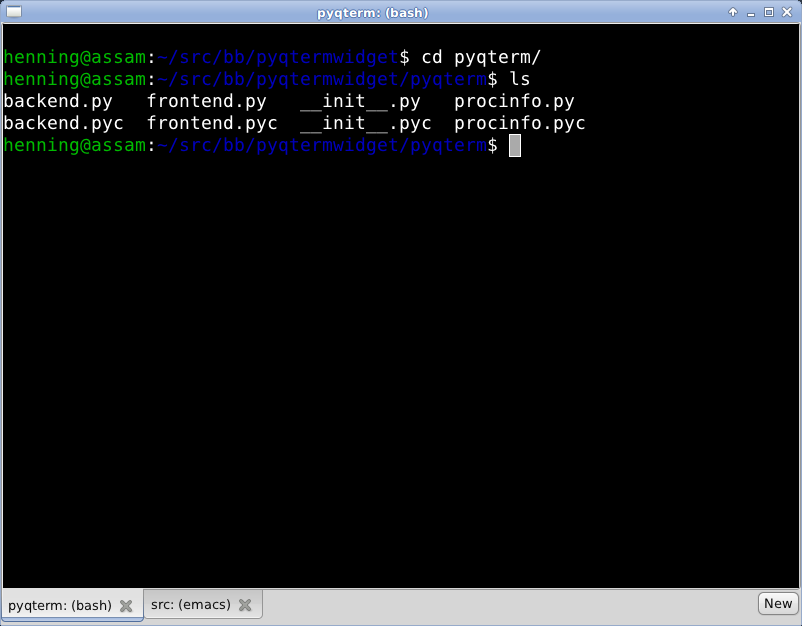

How to use PyQTermWidget
========================

Here is a minimal example:

.. code-block:: python

  #!/usr/bin/env python
  # -*- coding: utf-8 -*-

  from PyQt4.QtGui import QApplication
  from pyqterm import TerminalWidget
  
  
  if __name__ == "__main__":
      app = QApplication(sys.argv)
      win = TerminalWidget()
      win.resize(800, 600)
      win.show()
      app.exec_()

Look into *demo.py* for a more complete example with a tabbed terminal
application.

The constructor has the following signature:

 * def __init__(self, parent=None, command="/bin/bash", font_name="Monospace", font_size=18)

 
The widget has the following methods:
  
 * execute(command="/bin/bash")
 * send(string)
 * stop()
 * pid() -> process id (int)
 * zoom_in()
 * zoom_out()
 * text_selection() -> string
 * update_screen() 
 * is_alive() -> bool
 * row_count() -> int
 * column_count() -> int
 * text() -> string
 

TerminalWidget inherits directly from QWidget, so it has show, hide,
setFont, etc.

The widget emits the following signals:
 
 * session_closed()
 * return_pressed()
 

